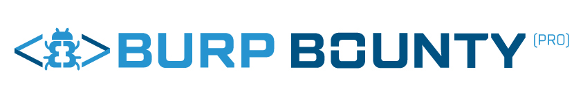

<p align="center">
  
  &nbsp;&nbsp;&nbsp;&nbsp;
  
</p>

<h1 align="center">Burp Bounty Vuln App</h1>

<p align="center">
  <strong>Intentionally vulnerable web application for testing
  <a href="https://bountysecurity.ai/pages/burp-bounty">Burp Bounty Pro</a> detection profiles</strong>
</p>

<p align="center">
  <a href="#quick-start">Quick Start</a>&nbsp;&nbsp;&bull;&nbsp;&nbsp;
  <a href="#vulnerability-categories">Categories</a>&nbsp;&nbsp;&bull;&nbsp;&nbsp;
  <a href="#how-to-use-with-burp-bounty-pro">Usage</a>&nbsp;&nbsp;&bull;&nbsp;&nbsp;
  <a href="https://bountysecurity.ai">Bounty Security</a>
</p>

---

> **WARNING:** This application is **intentionally insecure**. It contains real vulnerability patterns (XSS, SQLi, RCE, SSRF, etc.). **DO NOT** expose it to the internet or run it on a shared network. Use it only in isolated local environments.

## What is this?

Burp Bounty Vuln App provides a safe, local target to validate that your [Burp Bounty Pro](https://bountysecurity.ai/pages/burp-bounty) scanner profiles detect vulnerabilities correctly. It simulates **100+ vulnerability endpoints** across multiple categories so you can test your profiles against known-vulnerable patterns.

## Quick Start

### Using Docker Compose (recommended)

```bash
git clone https://github.com/BountySecurity/BurpBountyVulnApp.git
cd BurpBountyVulnApp
docker compose up --build
```

### Using Docker directly

```bash
docker build -t burpbounty-vulnapp .
docker run -p 8088:8088 burpbounty-vulnapp
```

Open **http://localhost:8088** in your browser.

## Vulnerability Categories

| Category | # | Description |
|:---------|:-:|:------------|
| **XSS** | 14 | Reflected, DOM, blind, attribute/tag/JS context, encoded |
| **SQL Injection** | 7 | Error-based, time-based, blind, OOB |
| **Remote Code Execution** | 13 | Command injection, eval, Log4j, blind RCE |
| **Path Traversal** | 3 | Linux/Windows file read, PHP include |
| **SSRF** | 6 | URL fetch, proxy, scheme bypass |
| **Open Redirect** | 4 | Basic, login, outbound, parameter pollution |
| **CORS** | 1 | Misconfigured CORS |
| **CRLF Injection** | 1 | Header injection |
| **SSTI** | 2 | Jinja2 template injection |
| **XXE** | 3 | XML parser, upload, SOAP |
| **GraphQL** | 6 | Introspection, injection |
| **CVEs** | 42 | Jira, Confluence, Grafana, FortiOS, Spring, Apache, Tomcat, WebLogic, and more |
| **WordPress** | 10 | Login, XMLRPC, user enum, plugin vulns |
| **Spring Boot** | 5 | Actuator endpoints |
| **Drupal** | 2 | User autocomplete, user profile |
| **Passive Detection** | 7 | Leaked secrets, insecure cookies, missing headers, tech fingerprints |
| **Header Injection** | 3 | X-Headers, Host header, password reset |

## How to Use with Burp Bounty Pro

1. **Start** the Vuln App with Docker
2. **Configure** your browser to use Burp Suite as a proxy
3. **Browse** to `http://localhost:8088` &mdash; the landing page lists all available endpoints
4. **Load** your Burp Bounty Pro profiles
5. **Scan** &mdash; run active/passive scans against the application
6. **Verify** that your profiles detect the expected vulnerabilities

## Requirements

- [Docker](https://www.docker.com/) and Docker Compose

## Links

- [Burp Bounty Pro](https://bountysecurity.ai/pages/burp-bounty)
- [Bounty Security](https://bountysecurity.ai)

## License

This project is provided for **educational and testing purposes only**. Use responsibly.
